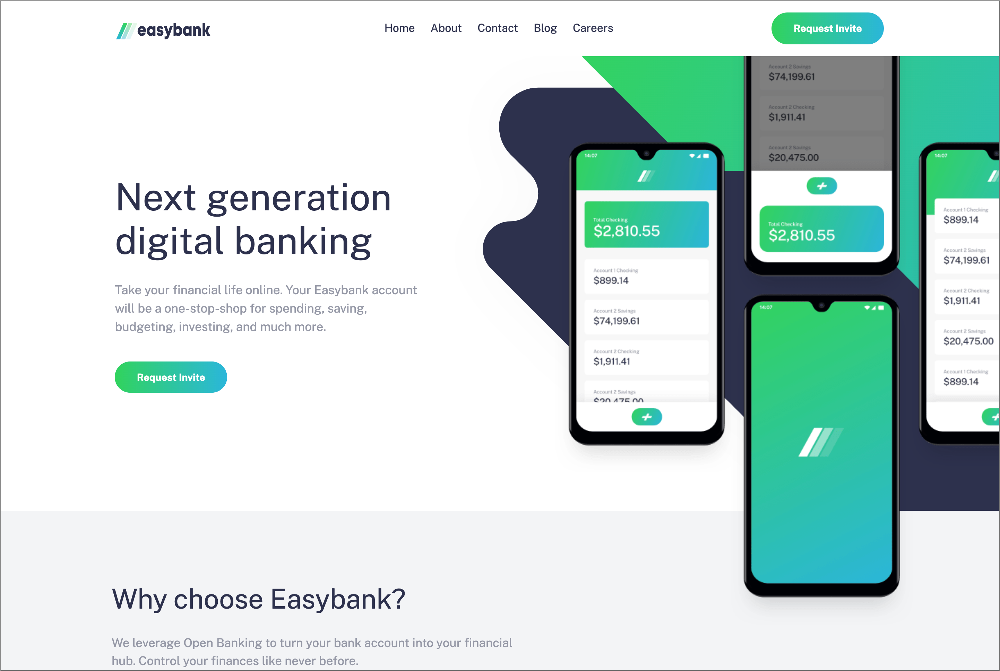
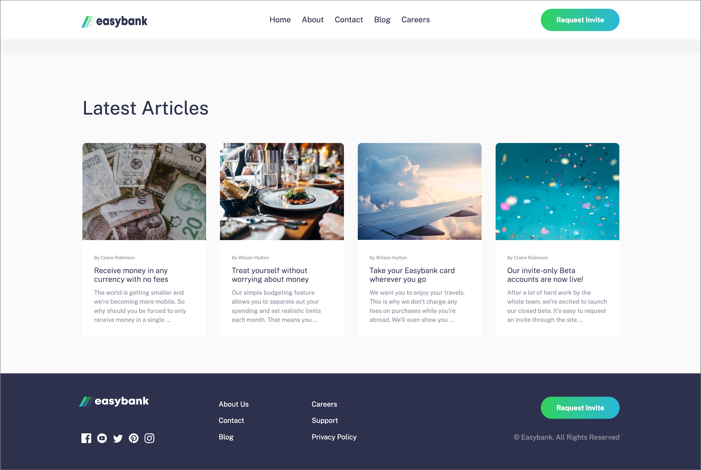
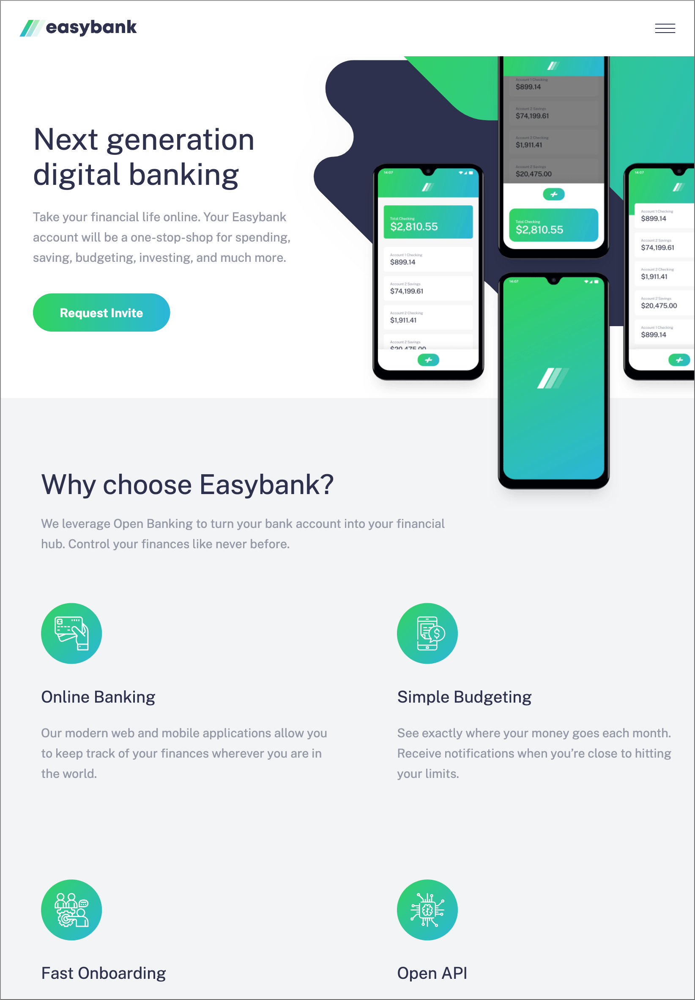
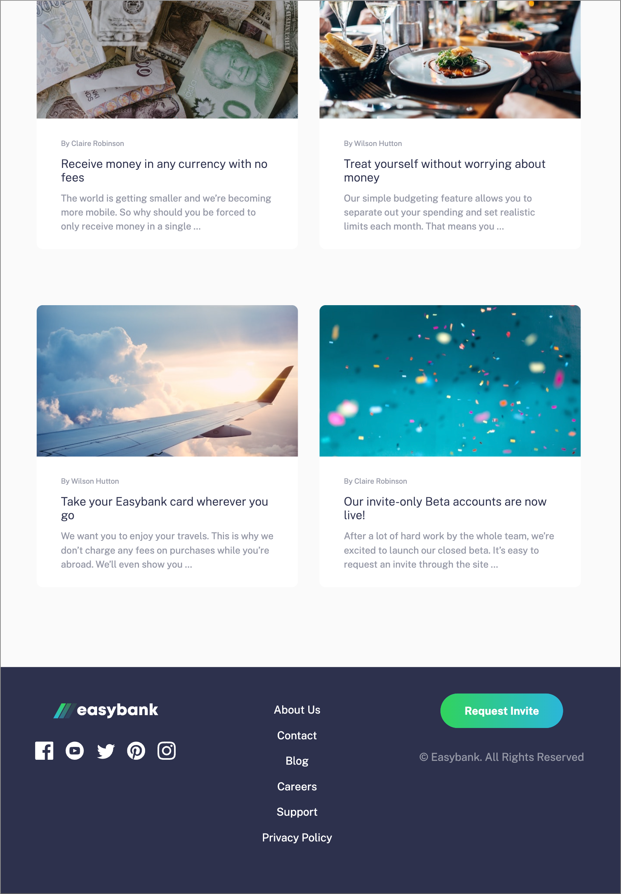
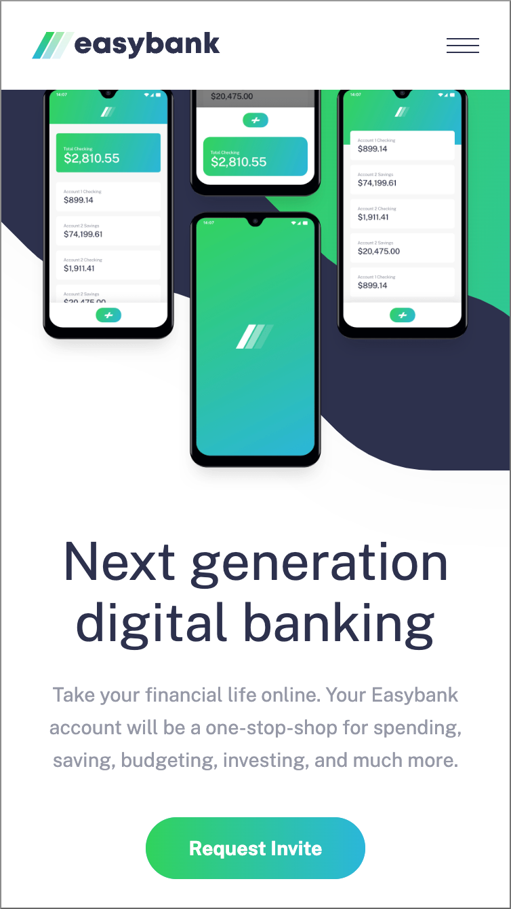
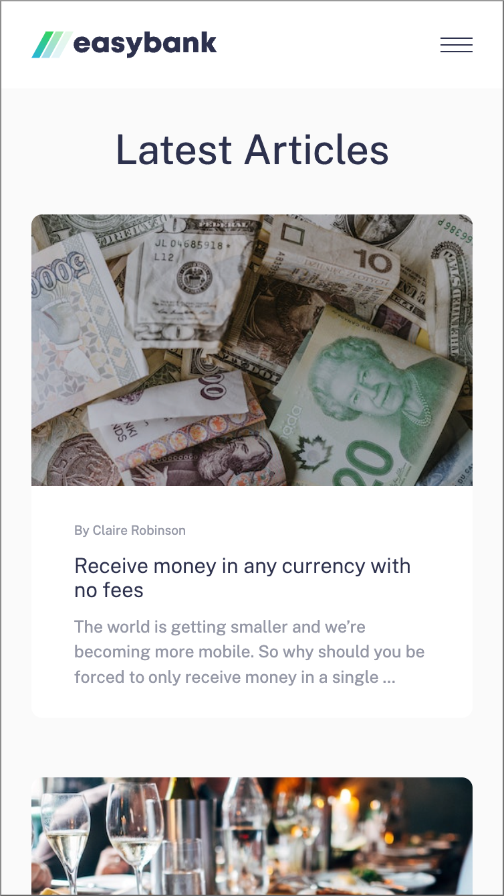
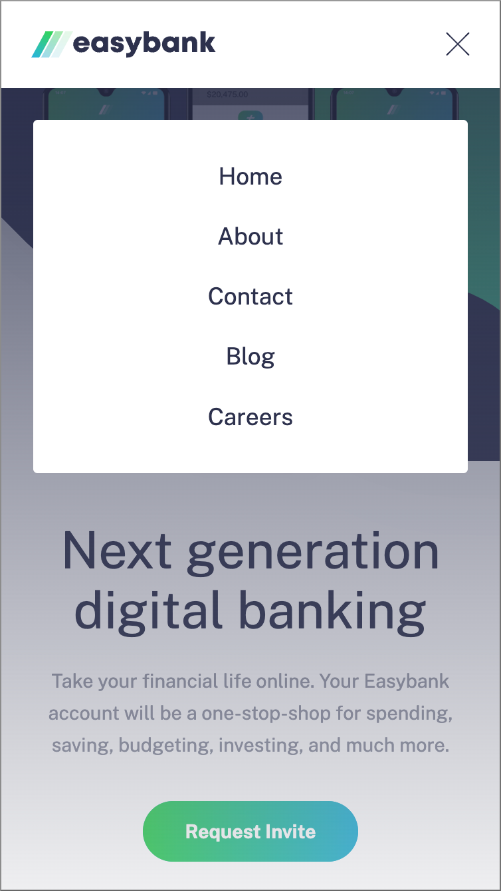

# Frontend Mentor - easybank-landing-page

I coded this lading-page for a bank myself and the layout was designed bij Frontend Mentor. Frontend Mentor provides challenges for frontend developers so they can make projects without the problem of designing the project. [See the challenge on Frontend Mentor.](https://www.frontendmentor.io/challenges/easybank-landing-page-WaUhkoDN)

## The challenge

The challenge was to make a lading page for a bank called easybank and let it look as close as possible to the design of front-end mentor. They provided a style-guide with the colors, font and screenshots of the design. Also a screenshot with active states was attached.

## Screenshots

  

## My experience

This time making the lay-out responsive had a lot of challenges. At the end the design doesn't look as close as I hoped it to be. It looks very close but there are points to work on. I'am happy with the animations for the mobile menu, buttons and menu items in the desktop layout.

### Links

- Solution URL: [github repository](https://github.com/Jolijn0101/easybank-landing-page)
- Live Site URL: [github page](https://jolijn0101.github.io/easybank-landing-page/)
